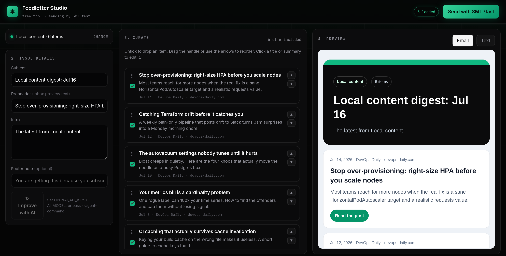

# Feedletter

Generate clean email digests from RSS feeds or local Markdown content.



Feedletter is a small open source CLI for teams that publish content and want a
fast path from "new posts exist" to "sent newsletter." It can read an RSS/Atom
feed or a local Markdown/MDX directory, select recent items, and write
email-safe HTML, plain text, and structured JSON.

The `feedletter studio` command opens a local browser tool where you pick which
items to include, reorder and edit them, tweak the subject and intro, watch a
live preview, and send the result with [SMTPfast](https://smtpfa.st). No hosting,
no account required to build; you only need an SMTPfast key when you want to send.

Optional AI enrichment can improve the subject, preheader, and intro using any
OpenAI-compatible chat completions API. You can also plug in a local/editor
agent command such as Claude Code, Codex, or your own script.

## Features

- browser studio: click-ops curation, inline editing, live preview, one-click send
- RSS/Atom and Markdown/MDX ingestion
- polished email-safe HTML and plain-text output
- per-recipient unsubscribe links via SMTPfast (`{{unsubscribe_url}}`)
- SQLite history tracking so the same post is not included twice
- custom editorial instructions from a Markdown file
- OpenAI-compatible enrichment
- external writer command support for Claude/Codex-style workflows

## Install

```bash
npm install -g feedletter
```

For local development:

```bash
npm install
npm run build
npm run dev -- build --content examples/content --base-url https://example.com
```

## Usage

Build from RSS:

```bash
feedletter build \
  --rss https://example.com/feed.xml \
  --title "This week's product updates" \
  --out dist/newsletter
```

Build from a Markdown content directory:

```bash
feedletter build \
  --content ./content/blog \
  --base-url https://example.com \
  --title "Latest from the blog" \
  --description "A short digest of the newest posts." \
  --limit 5
```

Preview the generated email:

```bash
feedletter preview --dir dist/feedletter --port 4173
```

Then open `http://127.0.0.1:4173`.

## CLI Reference

Every command also supports `--help`. The top-level command supports `--version`.

### `feedletter build`

| Flag | Default | Description |
| --- | --- | --- |
| `--rss <url>` | — | RSS or Atom feed URL. Provide this or `--content`. |
| `--content <dir>` | — | Local Markdown/MDX content directory. Provide this or `--rss`. |
| `--base-url <url>` | — | Base URL for relative Markdown slugs. |
| `--out <dir>` | `dist/feedletter` | Output directory for the generated issue. |
| `--limit <number>` | `5` | Number of items to include. |
| `--title <title>` | `Latest updates` | Digest subject and title. |
| `--description <text>` | — | Intro copy displayed before the item list. |
| `--source-label <label>` | source hostname or `Local content` | Small label displayed above the title. |
| `--instructions <file>` | — | Markdown file with voice, audience, sponsor, or editorial instructions. |
| `--history-db <path>` | `.feedletter/feedletter.sqlite` | SQLite file used to skip previously included items. |
| `--no-history` | history enabled | Do not read or write item history. |
| `--include-seen` | off | Allow items already present in the history database. |
| `--no-record-history` | history is recorded | Do not mark generated items as included after a successful build. |
| `--ai` | off | Use an OpenAI-compatible API to improve the subject, preheader, and intro. |
| `--ai-base-url <url>` | `AI_BASE_URL`, or `https://api.openai.com/v1` | AI API base URL. |
| `--ai-model <model>` | `AI_MODEL` | AI model name. |
| `--agent-command <command>` | — | External writer command that receives the editorial prompt on stdin and prints JSON. Cannot be used with `--ai`. |
| `--agent-timeout <ms>` | `120000` | Timeout for the external writer command. |
| `--tone <tone>` | `clear, useful, developer-friendly` | Writing tone used by AI or the external writer. |

### `feedletter preview`

| Flag | Default | Description |
| --- | --- | --- |
| `--dir <dir>` | `dist/feedletter` | Directory containing `email.html`, `email.txt`, and `issue.json`. |
| `--host <host>` | `127.0.0.1` | Host address for the preview server. |
| `--port <number>` | `4173` | Port for the preview server. |

### `feedletter studio`

| Flag | Default | Description |
| --- | --- | --- |
| `--host <host>` | `127.0.0.1` | Host address for the studio server. |
| `--port <number>` | `4180` | Port for the studio server. |
| `--content <dir>` | — | Default local Markdown/MDX content directory. |
| `--base-url <url>` | — | Default base URL for relative Markdown slugs. |
| `--from <email>` | — | Default sender address in the send panel. |
| `--history-db <path>` | `.feedletter/feedletter.sqlite` | SQLite file used to flag and skip previously sent items. |
| `--no-history` | history enabled | Do not track or flag previously sent items. |
| `--agent-command <command>` | — | Use an external writer, such as `claude -p` or `codex`, for Improve instead of the AI API. |
| `--agent-timeout <ms>` | `120000` | Timeout for the external writer command. |

### `feedletter send`

| Flag | Default | Description |
| --- | --- | --- |
| `--from <email>` | required | Verified sender, for example `Weekly <news@yourdomain.com>`. |
| `--dir <dir>` | `dist/feedletter` | Build output directory containing `issue.json`. |
| `--to <list>` | — | Recipients separated by commas, spaces, or newlines. |
| `--to-file <path>` | — | File containing one recipient per line; lines beginning with `#` are ignored. |
| `--footer <text>` | issue footer | Footer note displayed above the unsubscribe link. |
| `--api-key <key>` | `SMTPFAST_API_KEY` | SMTPfast API key. |
| `--api-url <url>` | `SMTPFAST_API_URL`, or SMTPfast default | SMTPfast API base URL. |
| `--test` | off | Send only to the first recipient and do not record history. |
| `--history-db <path>` | `.feedletter/feedletter.sqlite` | SQLite file used to record sent items. |
| `--no-history` | history enabled | Do not record sent items in history. |

## Studio

The studio is the fastest way to go from a feed to a sent issue. Start it and
open the printed URL:

```bash
feedletter studio
# or preload a source: feedletter studio --content ./content/blog --base-url https://example.com
```

In the studio you can:

- load items from an RSS/Atom feed or a Markdown directory
- start from a filled-in draft: the subject, preheader, and intro are written
  for you the moment items load
- include or drop each item, reorder by drag or arrows, and edit titles and
  summaries inline
- see an **already sent** badge on items from a previous issue, so you never
  send the same post twice (tracked in the same SQLite history as `build`)
- edit the subject, preheader, intro, and an optional footer note
- polish the copy with **Improve** (uses your own AI key server-side, or an
  external writer like `claude -p` or `codex` when you start studio with
  `--agent-command`, so you can skip the API entirely)
- watch a live email and plain-text preview as you go
- set a **From name** and pull each post's **cover image** into the email
- **save a draft** to JSON and open it later to pick up where you left off
- send with **SMTPfast**: paste an API key and a verified sender, and Feedletter
  checks the sender domain is verified, lets you send a test to yourself first,
  then sends one message per recipient so nobody sees the list, each with its
  own unsubscribe link
- for a large audience, hand the email off to a **SMTPfast broadcast** with one
  click instead of sending one at a time

You can deep-link a source: `http://127.0.0.1:4180/?feed=https://example.com/rss.xml`
or `?dir=./content/blog&base=https://example.com`.

## Automation

For a hands-off recurring newsletter, build and send from the command line, no
browser required. The `send` command reads a build output directory and sends
the issue with SMTPfast, re-rendering it with a per-recipient unsubscribe link:

```bash
feedletter build --rss https://your-blog.example.com/rss.xml --limit 6 --out dist/newsletter

SMTPFAST_API_KEY=sf_... feedletter send \
  --dir dist/newsletter \
  --from "Weekly <news@yourdomain.com>" \
  --to-file recipients.txt
```

Add `--test` to send only to the first recipient. Pair the two commands with a
scheduled GitHub Action to send every week automatically. A ready-to-copy
workflow is in [`examples/github-actions-newsletter.yml`](examples/github-actions-newsletter.yml):
it builds on a cron schedule, sends with SMTPfast, and commits the history file
back so the same post is never sent twice.

## Sending with SMTPfast

Sending is powered by [SMTPfast](https://smtpfa.st). It handles verified sending
domains, per-recipient unsubscribe, and deliverability, which is the part
Feedletter deliberately does not try to reinvent. Create a free account and an
API key in the dashboard, verify a sending domain, and paste the key into the
studio's send panel. For large audiences, use SMTPfast broadcasts and contacts
instead of a one-off recipient list.

## History Tracking

By default, `build` writes a real SQLite file at:

```text
.feedletter/feedletter.sqlite
```

Each generated item is recorded by URL when possible, with a hash fallback for
local content. Future builds skip previously included items.

Useful flags:

```bash
# Use a custom history location
feedletter build --content ./content/blog --history-db ./newsletter.sqlite

# Build from old items anyway
feedletter build --content ./content/blog --include-seen

# Generate a draft without recording it as included
feedletter build --content ./content/blog --no-record-history

# Disable history completely
feedletter build --content ./content/blog --no-history
```

## Custom Instructions

Create a Markdown file with voice, audience, sponsor, product, or formatting
guidance:

```markdown
# Newsletter Instructions

Write for senior backend engineers.
Keep the intro practical and avoid hype.
Mention that the digest is curated from our engineering blog.
```

Use it during generation:

```bash
feedletter build \
  --content ./content/blog \
  --instructions ./newsletter-instructions.md \
  --ai
```

Instructions are passed to AI or external writer commands and stored in
`issue.json` for traceability.

## AI And Agent Writers

Use optional AI enrichment:

```bash
OPENAI_API_KEY=sk_... AI_MODEL=your-model \
feedletter build \
  --rss https://example.com/feed.xml \
  --ai \
  --tone "concise, practical, founder-led"
```

The AI path uses `AI_BASE_URL` when set, otherwise it calls
`https://api.openai.com/v1/chat/completions`. Any compatible provider can be
used by setting `AI_BASE_URL`, `AI_API_KEY`, and `AI_MODEL`.

Use an external writer command:

```bash
feedletter build \
  --content ./content/blog \
  --agent-command "claude -p" \
  --instructions ./newsletter-instructions.md
```

The command receives the full editorial prompt on stdin and must print a JSON
object:

```json
{
  "subject": "A sharper subject line",
  "preheader": "A concise inbox preview.",
  "intro": "A short editorial intro.",
  "items": [
    {
      "title": "Optional rewritten item title",
      "summary": "Optional rewritten item summary."
    }
  ]
}
```

If a command needs the prompt as an argument instead of stdin, include
`{prompt}` in the command string:

```bash
feedletter build --rss https://example.com/feed.xml --agent-command "my-writer --prompt {prompt}"
```

## Output

Feedletter writes:

- `email.html` - email-safe HTML with inline styles
- `email.txt` - plain-text fallback
- `issue.json` - structured issue data for custom rendering or API use

## Markdown Frontmatter

Feedletter understands common frontmatter keys:

```yaml
---
title: "Shipping better status pages"
description: "What changed in our incident workflow."
date: "2026-05-31"
slug: "shipping-better-status-pages"
author: "Team"
---
```

Supported URL fields: `url`, `canonical`, `canonicalUrl`, or `slug` combined
with `--base-url`.

## Roadmap

- Custom template files
- Multiple layout presets
- GitHub Action example
- Direct export for common email providers
- Content deduping by previously sent URLs
- Optional image extraction
- In-browser issue editing before export

## License

MIT
